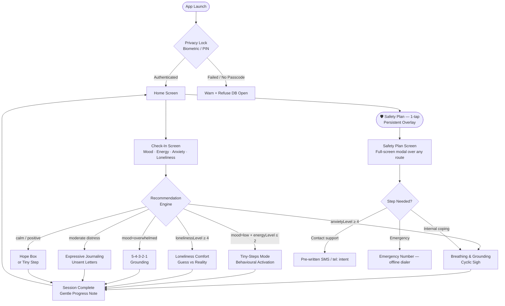

# Architecture.md
# Firefly — System Architecture & Technical Compass

**Version:** 1.0.0 | **Status:** Sprint 0 Living Document | **Updated:** 2026-09-30

---

## 1. What We Are Building

**Firefly** is a calm, 100% offline, privacy-critical mental wellbeing companion for Flutter (iOS & Android). It meets users in their hardest moments — late-night anxiety, overwhelming stress, creeping loneliness — and guides them through one small, evidence-informed step at a time.

It is **not** a diagnostic tool. It **does not** replace professional care. It is a quiet companion that works without a network, never stores unencrypted data, and never judges.

**Core Promise:**
> Deliver meaningful relief in under 2 minutes. Work offline forever. Own your data completely.

---

## 2. Target Users

| Profile | Scenario | App Entry Point |
|---|---|---|
| Evening distress | Overwhelmed after a hard day, can't decompress | Check-in → Breathing |
| Low-energy / flat mood | Can't start anything, stuck on the sofa | Check-in → Tiny Steps |
| Loneliness spike | Alone, not sure if reaching out is worth it | Check-in → Loneliness Comfort |
| Acute anxiety | Racing thoughts, physical tension | Check-in → Cyclic Sigh |
| Crisis precaution | Warning signs accumulating, needs a plan | Safety Plan (1-tap, persistent) |

**Scope boundary:** Mild-to-moderate distress. The Safety Plan is the escalation path for crisis — the app always surfaces it, never attempts to manage active crisis alone.

---

## 3. Feature Catalogue

### A. Affect Check-In
- Moon-phase mood selector (Heavy → Open, 5 states — no numeric 1-10 scale)
- Energy drag-slider ("Still" → "Moving")
- Loneliness, anxiety levels (visual, non-clinical selectors)
- **Output:** Deterministic `ActionSuggestion` from the recommendation engine → routes user to the most relevant feature

### B. Grounding & Respiration
- **Cyclic sighing** (default): double inhale + prolonged exhale, 4s/8s — backed by Balban et al. 2023
- **5-4-3-2-1 senses** grounding exercise with guided prompts
- Haptic phase-sync (light impact on inhale, single pulse on exhale)
- Ambient local audio loop (gentle rain / white noise / silence)
- `CustomPainter` bloom visualizer — smooth, no widget-tree rebuilds

### C. Tiny-Steps Mode (Behavioral Activation)
- Curated ≤ 2-minute micro-action library (drink water, open a window, stand up)
- Matched by energy level and affect state from check-in
- Completion: warm double-tap haptic + gentle sage fade — no confetti

### D. Expressive Journaling & Unsent Letters
- Free-text journaling with optional voice-to-text (Vosk offline STT)
- "Unsent letters" mode: write without sending — cathartic, private
- Per-entry TTL auto-delete toggle (cryptographic erasure on expiry)
- Pennebaker protocol guidance: 15–20 min prompts across 3–4 days (optional)

### E. Offline Safety Plan (Stanley-Brown Protocol)
- Six-step template: warning signs → internal coping → distraction contacts → support contacts → professional contacts → environment safety
- One-tap emergency access from **any screen** (persistent SOS overlay)
- Pre-written reach-out text templates ("Hey, having a rough day. Can we talk?")
- Offline emergency dialer (native `tel:` intent — no internet needed)
- All data encrypted on-device; no cloud sync

### F. Loneliness Comfort & Hope Box
- **Loneliness Comfort:** Gentle ambient sound, "Someone's here" breathing visual
- **Guess vs. Reality:** Log expected outcome before reaching out; record what happened after — builds evidence against catastrophic thinking
- **Hope Box:** Private offline vault — user photos, voice notes, favourite songs, written reasons to keep going
- Pre-written friction-reducing text prompts; one-tap launch of native SMS

---

## 4. App Flow & State Transitions



**Persistent Safety Plan Access:**
The SOS button is a floating overlay rendered above the `NavigationShell` via `Stack` — it exists on every screen including during active breathing sessions. Long-press activates the Panic Exit sequence.

---

## 5. Technology Stack

| Layer | Package / Tool | Version Pin | Rationale |
|---|---|---|---|
| Framework | Flutter + Dart 3.x | SDK ≥ 3.3.0 | Cross-platform, single codebase |
| State Management | `flutter_riverpod` + `riverpod_annotation` | ^2.5.x | Compile-safe, `AsyncNotifier`, guaranteed `onDispose` teardown |
| Code Generation | `build_runner` + `riverpod_generator` | ^2.4.x | Type-safe provider generation |
| Local Database | `drift` | ^2.18.x | Type-safe SQLite ORM, reactive streams, versioned migrations |
| Encryption | `sqlcipher_flutter_libs` | ^0.3.x | AES-256-CBC transparent SQLite encryption |
| Secure Key Storage | `flutter_secure_storage` | ^9.2.x | iOS Keychain / Android Keystore TEE |
| Biometric Auth | `local_auth` | ^2.3.x | Face ID, Touch ID, device passcode |
| Navigation | `go_router` | ^14.x | Declarative routes, shell routes, biometric guards |
| Audio | `just_audio` | ^0.9.x | Gapless local asset looping, cross-platform |
| Audio Session | `audio_session` | ^0.1.x | iOS/Android audio focus management |
| Haptics | Flutter `HapticFeedback` | SDK | Native haptic patterns, no package needed |
| Offline STT | `vosk_flutter` | ^0.3.x | 100% on-device speech recognition (no cloud) |
| File Picker | `file_picker` | ^8.x | User-initiated backup export/import |
| Path Provider | `path_provider` | ^2.1.x | App-private directory resolution |
| URL Launcher | `url_launcher` | ^6.3.x | Native `tel:` and `sms:` intents offline |
| Cryptography | `cryptography` | ^2.7.x | AES-GCM + Argon2id for backup engine |
| Linting | `flutter_lints` + `custom_lint` | ^4.x | Strict static analysis |

**Packages explicitly BANNED:** `http`, `dio`, `firebase_*`, `sentry_*`, `amplitude_*`, `mixpanel_*`, `google_sign_in`, any package making outbound network connections.

---

## 6. Folder & File Structure

```
lib/
│
├── main.dart                          # ProviderScope, HttpOverride kill switch, font init
│
├── core/
│   ├── database/
│   │   ├── app_database.dart          # Drift root + SQLCipher PRAGMA bootstrap
│   │   ├── app_database.g.dart        # Generated
│   │   ├── migrations/
│   │   │   └── migration_runner.dart  # Versioned migration logic
│   │   └── tables/
│   │       ├── mood_check_ins.dart
│   │       ├── journal_entries.dart
│   │       ├── safety_plan_tables.dart
│   │       ├── audio_preferences.dart
│   │       ├── app_configuration.dart
│   │       └── usage_summaries.dart
│   │
│   ├── security/
│   │   ├── key_manager.dart           # Secure key generation + retrieval
│   │   ├── biometric_guard.dart       # local_auth wrapper + DEK unlock gate
│   │   ├── journal_crypto_service.dart # Application-layer AES-GCM for journals
│   │   ├── cryptographic_eraser.dart  # Key rotation + VACUUM wipe
│   │   └── network_kill_switch.dart   # HttpOverrides.global override
│   │
│   ├── routing/
│   │   ├── app_router.dart            # go_router + ShellRoute + biometric redirect
│   │   ├── app_routes.dart            # Route name constants (no raw strings)
│   │   └── route_guards.dart          # Privacy lock + onboarding redirect logic
│   │
│   ├── theme/
│   │   ├── app_theme.dart             # AppTheme.darkTheme / lightTheme
│   │   ├── app_colors.dart            # Primitive palette + AppCustomColors extension
│   │   ├── app_typography.dart        # Atkinson Hyperlegible type scale
│   │   ├── animation_tokens.dart      # MotionTokens (breath-paced durations)
│   │   └── spacing_tokens.dart        # 4pt/8pt baseline grid
│   │
│   ├── contracts/
│   │   ├── audio_player_port.dart     # Abstract audio interface
│   │   ├── haptics_port.dart          # Abstract haptics interface
│   │   └── voice_recognition_port.dart # Abstract offline STT interface
│   │
│   ├── errors/
│   │   ├── app_exception.dart         # Domain exception types
│   │   ├── failure.dart               # Result<T, Failure> failure types
│   │   └── result.dart                # Result<T, E> sealed class
│   │
│   ├── recommendation_engine/
│   │   ├── recommendation_engine.dart # Pure Dart deterministic matcher
│   │   ├── affect_state.dart          # Input model
│   │   └── action_suggestion.dart     # Output model
│   │
│   └── utils/
│       ├── dart_extensions.dart
│       └── local_date_utils.dart
│
├── shared/
│   └── widgets/
│       ├── firefly_button.dart        # Primary CTA (56dp, scale+fade press)
│       ├── firefly_card.dart          # Elevated surface card
│       ├── sos_overlay_button.dart    # Persistent Safety Plan trigger
│       ├── panic_button.dart          # Long-press quick exit
│       ├── breathing_bloom_painter.dart # CustomPainter — bloom visualizer
│       ├── mood_tile.dart             # Moon-phase mood selector tile
│       ├── energy_slider.dart         # Still → Moving drag slider
│       └── gentle_progress_bar.dart   # Non-gamified progress indicator
│
└── features/
    ├── onboarding/
    │   └── presentation/screens/onboarding_screen.dart
    │
    ├── check_in/
    │   ├── data/
    │   │   ├── check_in_repository_impl.dart
    │   │   └── sources/check_in_local_source.dart
    │   ├── domain/
    │   │   ├── check_in_entry.dart
    │   │   └── check_in_repository.dart
    │   └── presentation/
    │       ├── screens/check_in_screen.dart
    │       ├── controllers/check_in_controller.dart
    │       └── widgets/
    │           ├── mood_selector_row.dart
    │           └── affect_result_card.dart
    │
    ├── breathing_grounding/
    │   ├── data/
    │   ├── domain/breathing_session.dart
    │   └── presentation/
    │       ├── screens/breathing_grounding_screen.dart
    │       ├── controllers/breathing_session_controller.dart
    │       └── widgets/
    │           ├── cyclic_sigh_bloom.dart
    │           └── grounding_prompt_card.dart
    │
    ├── tiny_steps/
    │   ├── data/
    │   ├── domain/tiny_step.dart
    │   └── presentation/
    │       ├── screens/tiny_steps_screen.dart
    │       └── controllers/tiny_steps_controller.dart
    │
    ├── journaling/
    │   ├── data/
    │   ├── domain/journal_entry.dart
    │   └── presentation/
    │       ├── screens/
    │       │   ├── journal_list_screen.dart
    │       │   └── journal_entry_screen.dart
    │       ├── controllers/journal_controller.dart
    │       └── widgets/voice_to_text_button.dart
    │
    ├── safety_plan/
    │   ├── data/
    │   ├── domain/
    │   │   ├── safety_plan.dart
    │   │   ├── safety_plan_contact.dart
    │   │   └── safety_plan_step.dart
    │   └── presentation/
    │       ├── screens/safety_plan_screen.dart
    │       ├── screens/safety_plan_editor_screen.dart
    │       └── controllers/safety_plan_controller.dart
    │
    ├── loneliness_comfort/
    │   ├── data/
    │   ├── domain/
    │   └── presentation/
    │       ├── screens/loneliness_comfort_screen.dart
    │       └── screens/guess_vs_reality_screen.dart
    │
    ├── hope_box/
    │   ├── data/
    │   ├── domain/hope_box_item.dart
    │   └── presentation/
    │       ├── screens/hope_box_screen.dart
    │       └── controllers/hope_box_controller.dart
    │
    └── gentle_progress/
        └── presentation/screens/gentle_progress_screen.dart
```

---

## 7. Data Flow Diagram

```
User Input (UI Widget)
        │
        ▼
Feature Controller (Riverpod AsyncNotifier)
        │
        ▼
Repository Interface (Domain boundary — abstract)
        │
        ▼
Repository Impl ──► DTO Mapper ──► Drift DAO
                                        │
                                        ▼
                              SQLCipher-Encrypted .db File
                              (Key sealed in iOS Keychain /
                               Android StrongBox TEE)
```

**Invariant:** No Widget ever touches a DAO. No Controller imports `drift` directly. The Repository is the only boundary-crosser.

---

## 8. Security Summary

| Concern | Mechanism |
|---|---|
| Data at rest | SQLCipher AES-256-CBC + journal AES-GCM double encryption |
| Key storage | `flutter_secure_storage` → iOS Keychain / Android Keystore |
| App unlock | `local_auth` biometric gate before DEK retrieval |
| Network prevention | `HttpOverrides.global` kill switch + Android NSC + iOS ATS |
| OS screenshot | `FLAG_SECURE` (Android) + blur overlay on `willResignActive` (iOS) |
| Backup | AES-256-GCM + Argon2id passphrase derivation |
| Expired journals | Cryptographic key rotation → permanent unreadability + VACUUM |
| Cloud sync block | `synchronizable: false` on all Keychain items |
