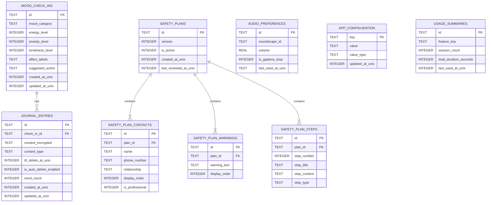

# LOCAL_BACKEND_ARCHITECTURE.md
# Firefly — On-Device Local Backend Architecture Specification

**Version:** 1.0.0
**Date:** 2026-09-30
**Status:** Sprint 0 — Approved Blueprint

> This document specifies the entire on-device data engine for Firefly. There are no cloud services, no telemetry, no external API contracts. Every computation described here executes locally on the user's device. This is the backend.

---

## Table of Contents
1. [Embedded Database Engine & Schema Design](#1-embedded-database-engine--schema-design)
2. [Local Repository & Data Access Layer](#2-local-repository--data-access-layer)
3. [On-Device Rule & Recommendation Engine](#3-on-device-rule--recommendation-engine)
4. [Hardware & Media Subsystems](#4-hardware--media-subsystems)
5. [Data Portability & Backup Engine](#5-data-portability--backup-engine)

---

## 1. Embedded Database Engine & Schema Design

### 1.1 Comparative Analysis: Database Engine Selection

The Firefly data engine requires ACID compliance, transparent at-rest encryption, relational integrity (foreign keys), stream-based reactive queries, and safe schema migration — all without cloud infrastructure.

| Criterion | **Drift + SQLCipher** | **Isar** | **Hive** |
|---|---|---|---|
| **ACID Compliance** | ✅ Full (SQLite WAL mode) | ✅ Full (LMDB transactions) | ❌ Partial — flush-on-write, no WAL |
| **At-Rest Encryption** | ✅ SQLCipher (AES-256-CBC, transparent) | ⚠️ Manual per-collection via AES, fragmented | ❌ None built-in (requires manual wrapping) |
| **Relational / FK Support** | ✅ Full SQL + FK constraints + JOINs | ❌ Document model, no FK enforcement | ❌ Key-Value only |
| **Reactive Streams** | ✅ `Stream<List<T>>` via Drift | ✅ Isar query `.watch()` | ⚠️ Hive box `listenable` (coarse-grained) |
| **Schema Migrations** | ✅ Versioned Drift migrations (Dart code) | ⚠️ Schema versioning limited, destructive by default | ❌ No migration support |
| **Query Power** | ✅ Full SQL (SELECT, JOIN, GROUP BY, CTEs) | ⚠️ Isar query builder (no JOINs) | ❌ No query language |
| **Cross-Platform (Desktop/Web)** | ✅ drift_sqflite / drift_wasm | ⚠️ Limited desktop / no Web | ✅ Hive (Web via IndexedDB) |
| **Corruption Recovery** | ✅ SQLite WAL ensures crash safety | ✅ LMDB copy-on-write | ❌ Risk on sudden kill |
| **Community & Maintenance** | ✅ Very high (Simon Binder, active) | ✅ High (isar_community fork, active) | ⚠️ Declining (Hive 2 stagnant) |

**Verdict: Drift + SQLCipher**

Drift is the unambiguous choice. The Safety Plan feature requires hierarchical relational data (contacts → steps → resources), which Isar's document model cannot enforce at the schema level. SQLCipher's transparent AES-256 encryption means zero application-level crypto burden. WAL mode (Write-Ahead Logging) ensures the database survives sudden process kills — critical on mobile where OOM killers are aggressive.

**Trade-off — Web:** `sql.js` (the WASM SQLite port) does not support SQLCipher. If Web is required, the `core/database` layer must conditionally use `drift_hive_storage` or IndexedDB with application-level AES-GCM encryption for the web target only, via factory pattern.

---

### 1.2 Database Initialization & Encryption Bootstrap

```dart
// lib/core/database/app_database.dart

import 'package:drift/drift.dart';
import 'package:drift_sqflite/drift_sqflite.dart';
import 'package:sqflite_sqlcipher/sqflite_sqlcipher.dart';
import 'package:firefly/core/security/key_manager.dart';

part 'app_database.g.dart';

@DriftDatabase(tables: [
  MoodCheckIns,
  JournalEntries,
  SafetyPlans,
  SafetyPlanContacts,
  SafetyPlanWarnings,
  SafetyPlanSteps,
  AudioPreferences,
  AppConfiguration,
  UsageSummaries,
])
class AppDatabase extends _$AppDatabase {
  AppDatabase(QueryExecutor executor) : super(executor);

  @override
  int get schemaVersion => 1;

  @override
  MigrationStrategy get migration => MigrationStrategy(
        onCreate: (m) async => await m.createAll(),
        onUpgrade: (m, from, to) async {
          await _runMigrations(m, from, to);
        },
        beforeOpen: (details) async {
          // Enforce foreign key integrity on every connection
          await customStatement('PRAGMA foreign_keys = ON');
          // WAL mode for crash safety
          await customStatement('PRAGMA journal_mode = WAL');
          // Optimize page size for mobile flash storage
          await customStatement('PRAGMA page_size = 4096');
        },
      );
}

/// Factory: Creates and opens the encrypted database.
/// The encryption key is fetched from the OS Secure Keystore — never hardcoded.
Future<AppDatabase> openEncryptedDatabase() async {
  final keyManager = KeyManager();
  final encryptionKey = await keyManager.getOrCreateDatabaseKey();

  final executor = SqfliteQueryExecutor.inDatabaseFolder(
    path: 'firefly_encrypted.db',
    singleInstance: true,
    creator: (db) async {
      // SQLCipher key pragma — applied before any table access
      await db.execute("PRAGMA key = '${encryptionKey}'");
    },
  );

  return AppDatabase(executor);
}
```

---

### 1.3 Full Database Schema

#### Entity-Relationship Diagram



---

#### Table Definitions (Drift)

```dart
// lib/core/database/tables/

// ─── Mood Check-Ins ───────────────────────────────────────────────────────────
class MoodCheckIns extends Table {
  TextColumn get id => text()();
  TextColumn get moodCategory => text()(); // 'anxious' | 'low' | 'overwhelmed' | 'lonely' | 'calm'
  IntColumn get energyLevel => integer().check(energyLevel.isBetweenValues(1, 5))();
  IntColumn get anxietyLevel => integer().check(anxietyLevel.isBetweenValues(1, 5))();
  IntColumn get lonelinessLevel => integer().check(lonelinessLevel.isBetweenValues(1, 5))();
  TextColumn get affectLabels => text().nullable()(); // JSON array of selected emotion words
  TextColumn get suggestedAction => text().nullable()(); // serialized ActionSuggestion
  IntColumn get createdAtUnix => integer()();
  IntColumn get updatedAtUnix => integer()();

  @override
  Set<Column> get primaryKey => {id};

  @override
  List<Set<Column>> get uniqueKeys => [];

  @override
  List<Index> get customIndices => [
        Index('mood_check_ins_created_at', 'CREATE INDEX IF NOT EXISTS '
            'mood_check_ins_created_at ON mood_check_ins (created_at_unix DESC)'),
      ];
}

// ─── Journal Entries ──────────────────────────────────────────────────────────
class JournalEntries extends Table {
  TextColumn get id => text()();
  TextColumn get checkInId => text().nullable().references(MoodCheckIns, #id,
      onDelete: KeyAction.setNull)();
  // content_encrypted: application-layer AES-GCM encrypted blob
  // (second encryption layer on top of SQLCipher for defense-in-depth)
  TextColumn get contentEncrypted => text()();
  TextColumn get contentType => text().withDefault(const Constant('text'))(); // 'text' | 'voice'
  IntColumn get ttlDeleteAtUnix => integer().nullable()(); // null = keep forever
  BoolColumn get isAutoDeleteEnabled => boolean().withDefault(const Constant(false))();
  IntColumn get wordCount => integer().withDefault(const Constant(0))();
  IntColumn get createdAtUnix => integer()();
  IntColumn get updatedAtUnix => integer()();

  @override
  Set<Column> get primaryKey => {id};
}

// ─── Safety Plans ─────────────────────────────────────────────────────────────
class SafetyPlans extends Table {
  TextColumn get id => text()();
  IntColumn get version => integer().withDefault(const Constant(1))();
  BoolColumn get isActive => boolean().withDefault(const Constant(true))();
  IntColumn get createdAtUnix => integer()();
  IntColumn get lastReviewedAtUnix => integer().nullable()();

  @override
  Set<Column> get primaryKey => {id};
}

class SafetyPlanContacts extends Table {
  TextColumn get id => text()();
  TextColumn get planId => text().references(SafetyPlans, #id,
      onDelete: KeyAction.cascade)();
  TextColumn get name => text()();
  TextColumn get phoneNumber => text().nullable()();
  TextColumn get relationship => text()();
  IntColumn get displayOrder => integer()();
  BoolColumn get isProfessional => boolean().withDefault(const Constant(false))();

  @override
  Set<Column> get primaryKey => {id};
}

class SafetyPlanWarnings extends Table {
  TextColumn get id => text()();
  TextColumn get planId => text().references(SafetyPlans, #id,
      onDelete: KeyAction.cascade)();
  TextColumn get warningText => text()();
  IntColumn get displayOrder => integer()();

  @override
  Set<Column> get primaryKey => {id};
}

class SafetyPlanSteps extends Table {
  TextColumn get id => text()();
  TextColumn get planId => text().references(SafetyPlans, #id,
      onDelete: KeyAction.cascade)();
  IntColumn get stepNumber => integer()();
  TextColumn get stepTitle => text()();
  TextColumn get stepContent => text()();
  // 'internal_coping' | 'distraction_contact' | 'support_contact' |
  // 'professional_contact' | 'environment_safety' | 'reasons_to_live'
  TextColumn get stepType => text()();

  @override
  Set<Column> get primaryKey => {id};
}

// ─── Audio Preferences ───────────────────────────────────────────────────────
class AudioPreferences extends Table {
  TextColumn get id => text()();
  TextColumn get soundscapeId => text()(); // maps to assets/audio/<id>.mp3
  RealColumn get volume => real().withDefault(const Constant(0.7))();
  BoolColumn get isGaplessLoop => boolean().withDefault(const Constant(true))();
  IntColumn get lastUsedAtUnix => integer().nullable()();

  @override
  Set<Column> get primaryKey => {id};
}

// ─── App Configuration (Key-Value Store) ─────────────────────────────────────
class AppConfiguration extends Table {
  TextColumn get key => text()();
  TextColumn get value => text()();
  TextColumn get valueType => text()(); // 'bool' | 'int' | 'double' | 'string'
  IntColumn get updatedAtUnix => integer()();

  @override
  Set<Column> get primaryKey => {key};
}

// ─── Usage Summaries (Privacy-Safe Local Analytics) ──────────────────────────
class UsageSummaries extends Table {
  TextColumn get id => text()();
  TextColumn get featureKey => text()(); // 'check_in' | 'breathing' | 'journal'
  IntColumn get sessionCount => integer().withDefault(const Constant(0))();
  IntColumn get totalDurationSeconds => integer().withDefault(const Constant(0))();
  IntColumn get lastUsedAtUnix => integer().nullable()();

  @override
  Set<Column> get primaryKey => {id};
}
```

---

### 1.4 Migration Strategy

All schema changes must be **safe, tested, and data-preserving**. Drift's migration system is column-additive by default — destructive changes require explicit data-preservation steps.

```dart
// lib/core/database/migrations/migration_runner.dart

Future<void> _runMigrations(
  Migrator m,
  int from,
  int to,
) async {
  // v1 → v2: Add voice transcription support to journal entries
  if (from < 2) {
    await m.addColumn(journalEntries, journalEntries.wordCount);
  }

  // v2 → v3: Add Hope Box feature tables
  if (from < 3) {
    await m.createTable(hopeBoxItems);
  }

  // v3 → v4: Rename mood_category to affect_category (data-safe migration)
  if (from < 4) {
    await customStatement('''
      ALTER TABLE mood_check_ins
      RENAME COLUMN mood_category TO affect_category
    ''');
  }
}
```

**Migration Rules:**
1.  **Never use `m.drop()`** in production without first copying data to a shadow table.
2.  **Schema version is monotonically increasing** — never decrement.
3.  **Migration tests** (`drift_dev` schema snapshot testing) must pass before any PR targeting a version bump is merged.
4.  **Rollback:** If a migration fails, the database remains on the previous WAL checkpoint. There is no automatic rollback, so migrations must be idempotent and defensive (use `IF NOT EXISTS`, `IF COLUMN NOT EXISTS`).

---

## 2. Local Repository & Data Access Layer

### 2.1 Architecture Overview

```
Presentation Layer (Riverpod Notifiers)
         │
         ▼
   Repository Interface          ← Domain boundary
         │
         ▼
  Repository Impl (Dart)
         │
    ┌────┴────┐
    ▼         ▼
  DAO       DTO Mapper
  (Drift)   (Entity ↔ Table Row)
    │
    ▼
SQLCipher Database File
```

The Repository layer is the **sole** intermediary between domain entities and raw Drift table rows. Notifiers never touch DAOs directly.

### 2.2 Data Access Objects (DAOs)

```dart
// lib/core/database/daos/mood_check_in_dao.dart

part of '../app_database.dart';

@DriftAccessor(tables: [MoodCheckIns])
class MoodCheckInDao extends DatabaseAccessor<AppDatabase>
    with _$MoodCheckInDaoMixin {
  MoodCheckInDao(super.db);

  /// Reactive stream: UI rebuilds automatically when new check-ins are inserted.
  Stream<List<MoodCheckIn>> watchRecent({int limit = 30}) =>
      (select(moodCheckIns)
            ..orderBy([(t) => OrderingTerm.desc(t.createdAtUnix)])
            ..limit(limit))
          .watch();

  Future<MoodCheckIn?> findLatest() =>
      (select(moodCheckIns)
            ..orderBy([(t) => OrderingTerm.desc(t.createdAtUnix)])
            ..limit(1))
          .getSingleOrNull();

  Future<void> insertCheckIn(MoodCheckInsCompanion entry) =>
      into(moodCheckIns).insert(entry);

  /// Returns aggregated mood distribution for the past N days.
  /// Used by the GentleProgress screen — no raw entries exposed.
  Future<Map<String, int>> getMoodDistribution({int pastDays = 7}) async {
    final cutoff = DateTime.now()
        .subtract(Duration(days: pastDays))
        .millisecondsSinceEpoch ~/
        1000;

    final rows = await (select(moodCheckIns)
          ..where((t) => t.createdAtUnix.isBiggerOrEqualValue(cutoff)))
        .get();

    return rows.fold<Map<String, int>>({}, (acc, row) {
      acc[row.moodCategory] = (acc[row.moodCategory] ?? 0) + 1;
      return acc;
    });
  }
}
```

### 2.3 Repository Implementation

```dart
// lib/features/check_in/data/check_in_repository_impl.dart

class CheckInRepositoryImpl implements CheckInRepository {
  CheckInRepositoryImpl(this._dao);
  final MoodCheckInDao _dao;

  @override
  Stream<List<CheckInEntry>> watchRecentCheckIns({int limit = 7}) =>
      _dao
          .watchRecent(limit: limit)
          .map((rows) => rows.map(CheckInMapper.fromRow).toList());

  @override
  Future<void> saveCheckIn(CheckInEntry entry) =>
      _dao.insertCheckIn(CheckInMapper.toCompanion(entry));

  @override
  Future<CheckInEntry?> getLatestCheckIn() async {
    final row = await _dao.findLatest();
    return row != null ? CheckInMapper.fromRow(row) : null;
  }
}
```

### 2.4 Offline Caching & Lazy-Loading Policies

| Data Type | Cache Strategy | Eviction |
|---|---|---|
| Recent check-ins (7 days) | Always in Drift stream — no extra cache needed | Drift handles; old rows stay until user deletes |
| Journal entries | Lazy-load on demand; only fetch content when entry is opened | TTL-based; scheduled wiper job (§5.2) |
| Audio file metadata | Preloaded at app start (< 1KB records) | Never evicted — tiny |
| Audio binary assets | Bundled in `assets/` (no network fetch) | N/A |
| Usage summaries | Written at session end; read only on Progress screen | Kept indefinitely (aggregated, not raw) |

**Lazy-Loading Pattern for Journal Archives:**
```dart
// Only load content when user navigates into the entry — not in list view
Stream<List<JournalEntryPreview>> watchJournalList() =>
    _dao.watchAllPreviews(); // returns id, created_at, word_count only — NOT content

Future<JournalEntry> loadEntryContent(String id) =>
    _dao.findById(id).then(JournalMapper.fromRow);
```

---

## 3. On-Device Rule & Recommendation Engine

### 3.1 Architecture Decision: Deterministic State Machine (Primary)

**Decision: Rule-based deterministic engine is mandatory for v1.0. On-device LLM is an opt-in, sandboxed, later addition.**

| Approach | Inference Speed | App Size Impact | Privacy | Safety Controllability | Offline Reliability |
|---|---|---|---|---|---|
| **Deterministic Rule Engine (Dart)** | < 1ms | 0 MB | ✅ Perfect | ✅ Full determinism | ✅ No model file needed |
| MediaPipe LLM (Gemma 2B, 4-bit) | 200–800ms (on-device) | +1.5–2.5 GB | ✅ On-device | ⚠️ Requires output filtering | ✅ Once model downloaded |
| MLC LLM (quantized Phi-3 Mini) | 100–400ms | +800 MB–2 GB | ✅ On-device | ⚠️ Requires output filtering | ✅ Once model downloaded |
| Cloud LLM (OpenAI, Gemini API) | 500–2000ms | 0 MB (client) | ❌ Data leaves device | ⚠️ External policy | ❌ Requires connectivity |

**Verdict:** A deterministic engine gives sub-millisecond response, zero app size cost, and 100% predictable output — which is non-negotiable for a crisis-adjacent app. LLM-generated prompts carry a risk of producing harmful content that a rule engine cannot. If an LLM feature is added later, it must be:
1.  Opt-in (user explicitly enables it).
2.  Sandboxed to reflective journaling prompts only (never crisis pathways).
3.  Filtered by a local keyword blocklist before display.

### 3.2 Rule Engine Implementation

```dart
// lib/core/recommendation_engine/recommendation_engine.dart

/// Immutable representation of a user's current check-in state.
class AffectState {
  const AffectState({
    required this.moodCategory,
    required this.energyLevel,
    required this.anxietyLevel,
    required this.lonelinessLevel,
  });

  final String moodCategory;  // 'anxious' | 'low' | 'overwhelmed' | 'lonely' | 'calm'
  final int energyLevel;      // 1–5
  final int anxietyLevel;     // 1–5
  final int lonelinessLevel;  // 1–5
}

/// The suggested action the app will surface to the user.
class ActionSuggestion {
  const ActionSuggestion({
    required this.actionType,
    required this.title,
    required this.body,
    required this.route,
    this.durationMinutes = 2,
  });

  final String actionType; // 'breathing' | 'tiny_step' | 'journaling' | 'reach_out' | 'ground'
  final String title;
  final String body;
  final String route;      // go_router path to navigate to
  final int durationMinutes;
}

class RecommendationEngine {
  /// Pure function — same input always produces same output.
  /// No IO, no async, no side effects. Testable in isolation.
  ActionSuggestion evaluate(AffectState state) {
    // Priority 1: High anxiety — immediate physiological regulation
    if (state.anxietyLevel >= 4) {
      return const ActionSuggestion(
        actionType: 'breathing',
        title: 'Let\'s slow things down',
        body: 'A 2-minute cyclic sigh can calm your nervous system right now.',
        route: '/home/breathe',
        durationMinutes: 2,
      );
    }

    // Priority 2: Very low energy + low mood — tiny behavioral activation step
    if (state.moodCategory == 'low' && state.energyLevel <= 2) {
      return const ActionSuggestion(
        actionType: 'tiny_step',
        title: 'One small thing',
        body: 'You don\'t have to do much. Just one gentle step.',
        route: '/home/tiny-steps',
        durationMinutes: 2,
      );
    }

    // Priority 3: Loneliness — social cognition nudge
    if (state.lonelinessLevel >= 4) {
      return const ActionSuggestion(
        actionType: 'reach_out',
        title: 'Someone would be glad to hear from you',
        body: 'People often appreciate being reached out to more than we expect.',
        route: '/home/check-in/reach-out',
        durationMinutes: 3,
      );
    }

    // Priority 4: Overwhelmed — grounding exercise
    if (state.moodCategory == 'overwhelmed') {
      return const ActionSuggestion(
        actionType: 'ground',
        title: 'Ground yourself in this moment',
        body: 'A 5-4-3-2-1 exercise can bring you back to the present.',
        route: '/home/breathe?mode=grounding',
        durationMinutes: 3,
      );
    }

    // Priority 5: Moderate distress — reflective journaling
    if (state.anxietyLevel >= 2 || state.energyLevel <= 3) {
      return const ActionSuggestion(
        actionType: 'journaling',
        title: 'Name what\'s here',
        body: 'Writing for a few minutes can help process what you\'re feeling.',
        route: '/home/journal/new',
        durationMinutes: 5,
      );
    }

    // Default: calm or positive state
    return const ActionSuggestion(
      actionType: 'tiny_step',
      title: 'Keep the momentum',
      body: 'You\'re doing well. One small kind act — for yourself or someone else.',
      route: '/home/tiny-steps',
      durationMinutes: 2,
    );
  }
}
```

### 3.3 Rule Engine Data Flow

```
User completes Check-In taps
         │
         ▼
CheckInController.submitCheckIn(state)
         │
         ▼
RecommendationEngine.evaluate(AffectState)     ← Pure Dart, <1ms
         │
         ▼
ActionSuggestion returned
         │
    ┌────┴──────────────┐
    ▼                   ▼
Save to DB           Navigate user
(CheckInRepository)  to suggested route
                     (context.go(suggestion.route))
```

---

## 4. Hardware & Media Subsystems

### 4.1 Local Audio Engine

**Package:** `just_audio` + `audio_session`

```dart
// lib/core/audio/just_audio_player_adapter.dart

class JustAudioPlayerAdapter implements AudioPlayerPort {
  final AudioPlayer _player = AudioPlayer();
  Timer? _fadeTimer;

  @override
  Future<void> play(AudioAsset asset, {bool loop = false}) async {
    final source = AssetAudioSource(_assetPath(asset));
    if (loop) {
      await _player.setAudioSource(
        LoopingAudioSource(count: 999, child: source), // gapless looping
      );
    } else {
      await _player.setAudioSource(source);
    }
    await _player.play();
  }

  @override
  Future<void> fadeIn({Duration duration = const Duration(milliseconds: 300)}) async {
    _player.setVolume(0.0);
    const steps = 20;
    final stepDuration = duration ~/ steps;
    int step = 0;
    _fadeTimer = Timer.periodic(stepDuration, (_) {
      step++;
      _player.setVolume((step / steps).clamp(0.0, 1.0));
      if (step >= steps) _fadeTimer?.cancel();
    });
  }

  @override
  Future<void> fadeOut({Duration duration = const Duration(milliseconds: 300)}) async {
    const steps = 20;
    final stepDuration = duration ~/ steps;
    double currentVolume = _player.volume;
    int step = 0;
    _fadeTimer = Timer.periodic(stepDuration, (_) {
      step++;
      _player.setVolume((currentVolume * (1 - step / steps)).clamp(0.0, 1.0));
      if (step >= steps) {
        _fadeTimer?.cancel();
        _player.pause();
      }
    });
  }

  String _assetPath(AudioAsset asset) => switch (asset) {
    AudioAsset.cyclicSighAmbience => 'assets/audio/cyclic_sigh_ambience.mp3',
    AudioAsset.groundingChime    => 'assets/audio/grounding_chime.mp3',
    AudioAsset.gentleRain        => 'assets/audio/gentle_rain.mp3',
    AudioAsset.whiteNoise        => 'assets/audio/white_noise.mp3',
  };

  @override
  void dispose() {
    _fadeTimer?.cancel();
    _player.dispose();
  }
}
```

**Gapless Looping Implementation:**
`just_audio`'s `LoopingAudioSource` ensures zero-gap looping by pre-buffering the next loop iteration before the current one ends. This is critical for ambient soundscapes — any audible gap would break the calming experience.

**Haptic Sync:**
Haptic ticks during breathing phases must be synchronized with audio phase transitions. The `BreathingSessionNotifier` (§1.3 of `FRONTEND_ARCHITECTURE.md`) calls both `_audio` and `_haptics` from the same phase-transition handler, ensuring < 16ms lag between audio cue and haptic pulse.

```dart
void _beginPhase(BreathingPhase phase) {
  // Both calls in the same synchronous tick = guaranteed sync
  _haptics.phaseTransition(phase);   // immediate haptic
  _audio.play(phaseAudioCue(phase)); // queued but starts within 1 audio frame
}
```

### 4.2 Local Notification Scheduler

**Package:** `flutter_local_notifications` + `timezone`

**Privacy Principles:**
1.  No notification content references mood, journal entries, or health state.
2.  Notifications are entirely opt-in — no default notifications on install.
3.  Notification text is generic and warm ("Firefly is here when you need it") — never guilt-inducing.
4.  All scheduling uses the device's native alarm manager (no persistent background service).

```dart
// lib/core/notifications/notification_scheduler.dart

class NotificationScheduler {
  final FlutterLocalNotificationsPlugin _plugin;

  Future<void> scheduleGentleReminder({
    required TimeOfDay time,
    required List<Day> days,
  }) async {
    await _plugin.zonedSchedule(
      _kReminderId,
      'Firefly', // title — no health data
      'You showed up for yourself before. I\'m here whenever you\'re ready.',
      _nextOccurrence(time, days),
      NotificationDetails(
        android: AndroidNotificationDetails(
          'firefly_reminders',
          'Gentle Reminders',
          importance: Importance.low,    // Silent by default on Android
          priority: Priority.low,
          silent: true,
          enableVibration: false,        // User controls haptics separately
        ),
        iOS: DarwinNotificationDetails(
          sound: 'chime_soft.aiff',
          interruptionLevel: InterruptionLevel.passive, // Never breaks focus mode
        ),
      ),
      androidScheduleMode: AndroidScheduleMode.inexactAllowWhileIdle,
      matchDateTimeComponents: DateTimeComponents.dayOfWeekAndTime,
    );
  }

  Future<void> cancelAllReminders() => _plugin.cancelAll();

  TZDateTime _nextOccurrence(TimeOfDay time, List<Day> days) {
    // Calculates the next local-timezone occurrence of the scheduled time
    // Uses the `timezone` package — no UTC conversion errors
    final now = TZDateTime.now(local);
    // ... implementation details
    return now; // placeholder
  }
}
```

---

## 5. Data Portability & Backup Engine

### 5.1 Architecture: Encrypted Export/Import

The backup is a **single AES-256-GCM encrypted archive** derived from a user-supplied passphrase via Argon2id. This means only the user can decrypt their own backup — even if the file is intercepted.

```
User data (JSON)
     │
     ▼
Gzip compress                          ← Reduces export size by ~60–70%
     │
     ▼
Argon2id(passphrase, random_salt)      ← Key derivation (memory-hard)
     │
     ▼
AES-256-GCM encrypt                   ← Authenticated encryption with random nonce
     │
     ▼
Archive format:
  [4 bytes: magic "FFBK"]
  [4 bytes: format version]
  [16 bytes: random salt]
  [12 bytes: AES-GCM nonce]
  [N bytes: ciphertext]
  [16 bytes: AES-GCM auth tag]
     │
     ▼
Write to user-chosen file location
(via file_picker / share_plus)
```

```dart
// lib/core/backup/backup_engine.dart

class BackupEngine {
  Future<File> exportEncryptedBackup({
    required String passphrase,
    required AppDatabase db,
  }) async {
    // 1. Serialize all user data to JSON
    final payload = await _serializeToJson(db);

    // 2. Gzip compress
    final compressed = GZipCodec().encode(utf8.encode(payload));

    // 3. Derive encryption key with Argon2id
    final salt = _generateSecureRandom(16);
    final key = await _deriveKey(passphrase: passphrase, salt: salt);

    // 4. AES-256-GCM encrypt
    final nonce = _generateSecureRandom(12);
    final cipher = AesGcm.with256bits();
    final secretKey = SecretKey(key);
    final secretBox = await cipher.encrypt(compressed, secretKey: secretKey, nonce: nonce);

    // 5. Assemble archive
    final archive = BytesBuilder()
      ..add(utf8.encode('FFBK'))         // magic
      ..add(_int32Bytes(1))              // format version
      ..add(salt)                        // 16-byte salt
      ..add(nonce)                       // 12-byte nonce
      ..add(secretBox.cipherText)        // ciphertext
      ..add(secretBox.mac.bytes);        // 16-byte auth tag

    // 6. Write to temp file
    final outputPath = await _getTempExportPath();
    final file = File(outputPath);
    await file.writeAsBytes(archive.takeBytes());
    return file;
  }

  Future<void> importEncryptedBackup({
    required File archiveFile,
    required String passphrase,
    required AppDatabase db,
  }) async {
    final bytes = await archiveFile.readAsBytes();

    // Verify magic bytes
    if (utf8.decode(bytes.sublist(0, 4)) != 'FFBK') {
      throw InvalidBackupException('Not a valid Firefly backup file');
    }

    final salt       = bytes.sublist(8, 24);
    final nonce      = bytes.sublist(24, 36);
    final cipherText = bytes.sublist(36, bytes.length - 16);
    final mac        = bytes.sublist(bytes.length - 16);

    // Derive key and decrypt — throws if passphrase is wrong (auth tag mismatch)
    final key = await _deriveKey(passphrase: passphrase, salt: salt);
    final cipher = AesGcm.with256bits();
    final plaintext = await cipher.decrypt(
      SecretBox(cipherText, nonce: nonce, mac: Mac(mac)),
      secretKey: SecretKey(key),
    );

    // Decompress and restore
    final json = utf8.decode(GZipCodec().decode(plaintext));
    await _restoreFromJson(json, db);
  }

  Future<Uint8List> _deriveKey({
    required String passphrase,
    required List<int> salt,
  }) async {
    // Argon2id: memory-hard KDF — resistant to GPU/ASIC brute force
    final argon2 = Argon2id(
      memory: 65536,       // 64 MB memory cost
      parallelism: 2,
      iterations: 3,
      hashLength: 32,      // 256-bit key
    );
    return argon2.deriveKey(
      secretKey: SecretKey(utf8.encode(passphrase)),
      nonce: Uint8List.fromList(salt),
    ).then((k) async => Uint8List.fromList(await k.extractBytes()));
  }
}
```

### 5.2 Secure Journal Wipe Engine

Standard file deletion (unlink) does not overwrite data — the bytes persist on flash storage until the sector is reused. For journals with TTL flags, Firefly performs a **secure wipe** before unlinking.

**Note on Mobile Flash Storage (NAND):** True byte-level overwriting is not guaranteed on NAND flash due to wear-leveling at the controller level. The most reliable approach on mobile is:
1.  Overwrite the database row content with random bytes before deletion.
2.  Issue a `VACUUM` to the SQLCipher database (reorganizes pages, removing freed content).
3.  On iOS, `Data Protection` (Full Protection class) ensures blocks are crypto-erased when the device is locked.

```dart
// lib/core/security/secure_wipe_service.dart

class SecureWipeService {
  final AppDatabase _db;
  SecureWipeService(this._db);

  /// Scheduled daily: finds and wipes expired journal entries.
  Future<void> wipeExpiredEntries() async {
    final nowUnix = DateTime.now().millisecondsSinceEpoch ~/ 1000;
    final expired = await _db.journalEntryDao.findExpiredEntries(nowUnix);

    for (final entry in expired) {
      // Step 1: Overwrite content with random data before deletion
      await _db.journalEntryDao.overwriteContent(
        id: entry.id,
        randomContent: _generateRandomString(entry.wordCount * 6),
      );

      // Step 2: Delete the row
      await _db.journalEntryDao.deleteById(entry.id);
    }

    // Step 3: VACUUM to remove freed page content from the SQLite file
    await _db.customStatement('VACUUM');
  }

  String _generateRandomString(int length) {
    const chars = 'abcdefghijklmnopqrstuvwxyz0123456789';
    final rng = Random.secure();
    return List.generate(length, (_) => chars[rng.nextInt(chars.length)]).join();
  }
}
```

**Wipe Scheduling:**
The wipe job runs via a background Flutter isolate triggered by `flutter_local_notifications`'s `onDidReceiveBackgroundNotificationResponse` callback — no persistent background service required.

---

## Appendix A: Security Threat Model

| Threat | Mitigation |
|---|---|
| Device physical theft | SQLCipher AES-256 — database unreadable without key |
| Key extraction from storage | `flutter_secure_storage` → OS Keychain / EncryptedSharedPreferences |
| Backup file interception | AES-256-GCM + Argon2id — useless without user passphrase |
| Accidental cloud sync (iCloud/Drive) | Export file extension `.ffbk` (non-standard) and stored in app-private directory |
| LLM output injection (future) | Sandboxed, opt-in, filtered — never on crisis pathways |
| Data remanence after deletion | Row overwrite + VACUUM + iOS Data Protection |
| Network exfiltration | No `http` package dependency; zero outbound sockets |

---

## Appendix B: Package Manifest (Local Backend)

| Package | Version Pin | Purpose |
|---|---|---|
| `drift` | `^2.18.0` | ORM + reactive streams |
| `drift_sqflite` | `^2.4.0` | SQLite executor for mobile |
| `sqflite_sqlcipher` | `^2.2.1` | Encrypted SQLite (AES-256) |
| `flutter_secure_storage` | `^9.2.2` | OS Keychain / Keystore key management |
| `just_audio` | `^0.9.40` | Gapless audio engine |
| `audio_session` | `^0.1.21` | iOS/Android audio focus management |
| `flutter_local_notifications` | `^17.2.4` | Offline notification scheduling |
| `timezone` | `^0.9.4` | Local-time-correct scheduling |
| `cryptography` | `^2.7.0` | AES-GCM + Argon2id for backup engine |
| `vosk_flutter` | `^0.3.0` | Offline speech recognition |
| `file_picker` | `^8.1.2` | User-initiated file export/import |
| `path_provider` | `^2.1.4` | App-private storage path resolution |

---

*Document maintained by the Firefly Engineering Team. Update version header on any structural change.*
