# Audio Taxonomy & Semantic Tagging Architecture

**Document Reference:** FIREFLY-AUDIO-TAX-05  
**Taxonomy Depth:** 3 Levels (Domain > Category > Subcategory) + Multi-dimensional Attribute Facets  
**Target Platform:** Firefly Flutter Mobile Client & Local Recommendation Engine

---

## 1. Domain & Category Hierarchy

The Firefly Audio Library organizes soundscapes along two orthogonal axes:
1. **Acoustic Origin:** Where the sound comes from (Nature, Hydrology, Forest, Noise, Drone, Bioacoustic).
2. **Intentional State:** What emotional, somatic, or cognitive transition the user is seeking (Down-regulation, Sleep Induction, Focus/Masking, Grounding).

```mermaid
graph TD
    Root[Firefly Audio Sanctuary]
    
    Root --> Nature[1. Nature Soundscapes]
    Root --> Noise[2. Acoustic Masking & Noise]
    Root --> Drones[3. Harmonic Drones & Binaural]
    Root --> Chimes[4. Resonant Tones & Chimes]
    Root --> Organic[5. Organic Bio-Ambience]
    
    Nature --> Rain[Rain & Storms: Gentle, Heavy, Window, Tent, Leaves, Thunder]
    Nature --> Water[Hydrology: Ocean, River, Waterfall, Cave Droplets]
    Nature --> Woodland[Forest & Arboreal: Morning Birds, Wind in Trees, Jungle, Leaf Steps]
    Nature --> Night[Nocturnal: Crickets, Campfire, Crisp Snow]
    
    Noise --> Brown[Brown Noise: Deep Velvet 1/f^2]
    Noise --> Pink[Pink Noise: Balanced 1/f]
    Noise --> White[White Noise: Uniform Gaussian]
    
    Drones --> Delta[Delta 2.5 Hz: Sleep Entrainment]
    Drones --> Theta[Theta 6 Hz: Meditative Flow]
    Drones --> Alpha[Alpha 10 Hz: Alert Calm Focus]
    Drones --> Sigh[0.1 Hz Cyclic Sigh Envelope]
    
    Chimes --> Tibetan[Tibetan Grounding Bowl]
    Chimes --> Bamboo[Bamboo Wind Chimes]
    
    Organic --> Purr[Rhythmic Cat Purr]
    Organic --> Bubbles[Hydrophonic Bubbles]
    Organic --> Clock[Antique Clock Cadence]
```



---

## 2. Multi-Dimensional Attribute Facets

Each cataloged track contains standardized behavioral facets allowing filtering and recommendation by Firefly’s offline heuristic engine:

### A. Somatic Arousal Level (`arousalLevel`)
- **Very Low (1–2):** Deep rest, sleep latency reduction, down-regulation after panic.  
  *Examples:* `calm_brown_noise`, `binaural_delta_drone`, `rain_on_window`.
- **Moderate Low (3–4):** Unwinding, journaling companion, parasympathetic activation.  
  *Examples:* `gentle_rain`, `ocean_waves`, `forest_birds`, `cat_purring`.
- **Steady Neutral (5–6):** Focus, reading, studying, sensory masking without sedation.  
  *Examples:* `soft_pink_noise`, `binaural_alpha_drone`, `river_stream`, `rhythmic_clock`.

### B. Masking Profile (`maskingProfile`)
- **Low-Frequency Dominant:** Ideal for masking low vehicular rumbles, distant construction, and elevator vibrations (`calm_brown_noise`, `thunder_rumble`, `ocean_waves`).
- **Broadband Equal-Energy:** Ideal for masking mixed urban chatter and household appliances (`soft_pink_noise`, `gentle_rain`, `waterfall`).
- **Transient / Point-Source Masking:** High-frequency dispersion for open-office background hum (`gentle_white_noise`, `river_stream`).

### C. Sensory Grounding Index (`groundingIndex`)
For trauma-informed 5-4-3-2-1 exercises or panic recovery:
- High tactile / vivid imagery: `walk_on_leaves`, `walk_in_snow`, `warm_campfire`, `grounding_chime`.

---

## 3. Dynamic Tagging Schema

The following structured vocabulary is indexed locally in `audio_catalogue.json`:

```json
{
  "environments": ["Rain", "Ocean", "River", "Forest", "Night", "Fire", "Cave", "Snow", "Abstract", "Temple", "Domestic"],
  "moods": ["Peaceful", "Immersive", "Cozy", "Sheltered", "Serene", "Atmospheric", "Rhythmic", "Refreshing", "Uplifting", "Grounding", "Centered", "Alert Calm", "Safe & Warm", "Weightless"],
  "useCases": ["Sleep", "Relax", "Focus", "Anxiety Relief", "Panic Recovery", "Journaling", "Meditation", "Reading", "Study"]
}
```
