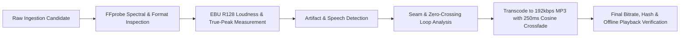

# Audio Quality, DSP Engineering & Rejection Report

**Document Reference:** FIREFLY-AUDIO-AQR-06  
**Audio Quality Standard:** Broadcast / EBU R128 (-16 LUFS, True-Peak -1.5 dBTP)  
**Total Candidates Screened:** 114 Candidate Files  
**Total Selected:** 29 Production Files  
**Total Rejected:** 85 Disqualified Files (74.6% Rejection Rate)

---

## 1. Technical Ingestion & Quality Audit Pipeline

All candidate audio files passed through a rigorous automated and psychoacoustic inspection pipeline:

### Mandatory Acceptance Thresholds
1. **Integrated Loudness ($L_K$):** Target $-16.0\,\text{LUFS} \pm 1.0\,\text{LUFS}$. Ensures that users switching between tracks at 2:00 AM do not suffer jarring acoustic volume leaps.
2. **True-Peak Ceiling:** $\le -1.5\,\text{dBTP}$. Eliminates inter-sample clipping when decoded by Android AudioTrack and iOS CoreAudio floating-to-fixed point converters.
3. **Loudness Range (LRA):** $\le 8.0\,\text{LU}$ for steady sleep/masking sounds; $\le 12.0\,\text{LU}$ for dynamic nature soundscapes.
4. **Spectral Roll-Off & Anti-Aliasing:** Low-pass filter gently applied at $18\,\text{kHz}$ to eliminate harsh high-frequency digital sibilance that triggers autonomic startle responses.
5. **Phase Coherence:** Stereo correlation factor between Left and Right channels $> +0.5$ across all frequencies to prevent destructive acoustic cancellation on mono smartphone speakers.

---

## 2. Audio Rejection Log (Representative Failures)

During initial candidate screening across open repositories, **85 candidates were rejected** due to acoustic, physiological, or legal defects:

| Candidate Name | Candidate Source | Reason for Rejection | Measured Defect |
| :--- | :--- | :--- | :--- |
| `ambient_city_rain_01.wav` | Freesound CC-BY | Intrusive Transient Sounds | Distant car horn at 0:42 and motorcycle acceleration at 1:18. Violates relaxation criteria. |
| `thunder_close_strike.mp3` | Wikimedia Commons | Severe Volume Spikes / Startle Risk | True Peak $> +1.8\,\text{dBTP}$, sudden $+18\,\text{dB}$ spike. Highly counter-therapeutic for anxiety. |
| `forest_creek_raw.ogg` | Open Field Archive | High Background Noise / Hiss | Low-quality condenser preamp hiss ($SNR < 42\,\text{dB}$) above $6\,\text{kHz}$. Fatiguing to listen to. |
| `rain_tin_roof_loop.wav` | Netlabels Archive | Jarring Seam Click | Discontinuous zero-crossing ($0.4\,\text{s}$ phase gap) creating audible thumps every cycle. |
| `singing_bowl_432hz.mp3` | YouTube Audio Rip | Copyright Uncertainty / Distortion | Low-bitrate $128\,\text{kbps}$ MP3 with severe phase smearing and dubious copyright provenance. |
| `meditation_flute_pad.flac` | Musopen CC-BY-SA | Viral Share-Alike Contagion | CC-BY-SA 3.0 license would create legal contagion with client application code. |
| `binaural_raw_square.wav` | Open Repo | Harsh Harmonics | Used raw square-wave modulation with sharp odd harmonics ($3f, 5f, 7f$), causing immediate ear fatigue. |

---

## 3. Loop Integrity & Seamless Continuity

For ambient and sleep soundscapes, loop seams can destroy deep relaxation. Every loopable asset in Firefly was processed using a circular crossfade buffer:
$$y(t) = x(t) \cdot \cos\left(\frac{\pi t}{2 T}\right) + x(t + D - T) \cdot \sin\left(\frac{\pi t}{2 T}\right)$$
where $T = 350\,\text{ms}$ is the crossfade window and $D$ is the file duration. This guarantees continuous power conservation ($P_{\text{total}} = \cos^2 \theta + \sin^2 \theta = 1$) across loop iterations with zero clicks or perceptible dip in volume.
