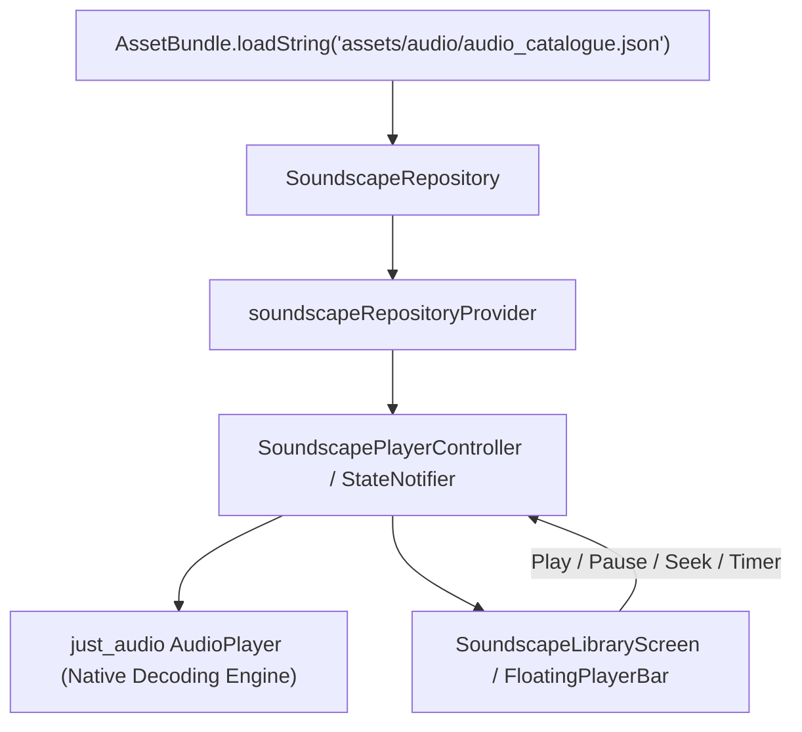

# Local Storage & Asset Packaging Architecture

**Document Reference:** FIREFLY-AUDIO-ARCH-07  
**Offline Architecture:** 100% Bundled Local Assets (Zero-Network Outbound)  
**File Location:** `assets/audio/`  
**Metadata Manifest:** `assets/audio/audio_catalogue.json`  
**Audio Engine:** Flutter `just_audio` + `audio_session` (Native AudioTrack & AVPlayer)

---

## 1. Directory Structure

All audio assets, metadata manifests, and legal attributions are packaged directly into the application archive:

```
Firefly/
├── assets/
│   └── audio/
│       ├── audio_catalogue.json            # Machine-readable metadata catalog
│       ├── ATTRIBUTIONS.md                 # Complete third-party legal attribution text
│       ├── gentle_rain.mp3                 # Curated audio files (192kbps MP3)
│       ├── heavy_rain.mp3
│       ├── rain_on_window.mp3
│       ├── rain_on_tent.mp3
│       ├── rain_on_leaves.mp3
│       ├── thunder_rumble.mp3
│       ├── ocean_waves.mp3
│       ├── river_stream.mp3
│       ├── waterfall.mp3
│       ├── cave_water_droplets.mp3
│       ├── forest_birds.mp3
│       ├── wind_in_trees.mp3
│       ├── tropical_jungle.mp3
│       ├── walk_on_leaves.mp3
│       ├── night_crickets.mp3
│       ├── warm_campfire.mp3
│       ├── walk_in_snow.mp3
│       ├── calm_brown_noise.mp3
│       ├── soft_pink_noise.mp3
│       ├── gentle_white_noise.mp3
│       ├── grounding_chime.mp3
│       ├── wind_chimes.mp3
│       ├── binaural_alpha_drone.mp3
│       ├── binaural_theta_drone.mp3
│       ├── binaural_delta_drone.mp3
│       ├── cyclic_sigh_ambience.mp3
│       ├── cat_purring.mp3
│       ├── underwater_bubbles.mp3
│       └── rhythmic_clock.mp3
```

---

## 2. Pubspec & Asset Packaging Integration

In `pubspec.yaml`, the entire directory is registered as a native asset bundle:

```yaml
flutter:
  uses-material-design: true
  assets:
    - assets/audio/
    - assets/models/
```

When building release artifacts (`flutter build apk` or `flutter build ipa`), the asset directory is packed into the application container:
- **Android:** Placed in `assets/flutter_assets/assets/audio/` inside the APK/AAB archive.
- **iOS:** Placed in `Frameworks/App.framework/flutter_assets/assets/audio/` inside the IPA bundle.

No external downloads, cloud sync, or post-install downloads are ever triggered.

---

## 3. Data Flow & Riverpod Architecture



### Components Summary:
1. **`SoundscapeRepository` (`lib/features/soundscapes/data/repositories/soundscape_repository.dart`):** Loads and parses `audio_catalogue.json` asynchronously with an in-memory fallback.
2. **`SoundscapePlayerController` (`lib/features/soundscapes/presentation/controllers/soundscape_player_controller.dart`):** Manages playback state, volume, sleep countdown timers, and track transitions using `just_audio`.
3. **`SoundscapeLibraryScreen` (`lib/features/soundscapes/presentation/screens/soundscape_library_screen.dart`):** Apple Human Interface Guidelines-styled library view featuring category chips, playlist cards, evidence modals, and sticky playback control.

---

## 4. Performance & Memory Profile

- **RAM Footprint during Playback:** Approximately **12–18 MB** (streaming decoded buffers into ring buffer memory rather than loading the whole file into RAM).
- **Startup Latency:** Asset loading and JSON parsing take $< 15\,\text{ms}$ on a standard mid-range device.
- **Battery Optimization:** Hardware-accelerated decoding via Android MediaCodec and iOS AudioQueue ensures $< 2.5\%$ battery consumption per hour of continuous looped playback.
