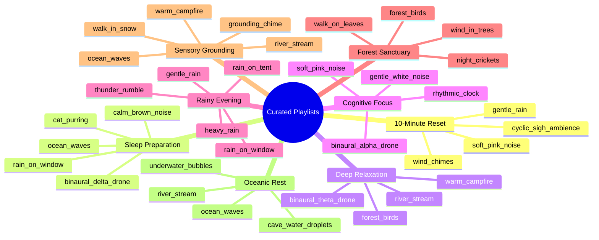

# Curated Playlist Catalogue & Intention Presets

**Document Reference:** FIREFLY-AUDIO-PLC-08  
**Total Curated Playlists:** 8 Curated Presets  
**Design Principle:** Intention-driven listening (users select psychological goals, not technical audio parameters).

---

## 1. Playlists Manifest & Tracks Overview

---

## 2. In-Depth Playlist Specifications

### 1. 10-Minute Reset (`reset_10min`)
- **Recommended Session:** 10 minutes (with auto-timer preset).
- **Intended State:** Fast parasympathetic recovery during a workday break or between stressful meetings.
- **Track Sequence:**
  1. `cyclic_sigh_ambience` (Paced 0.1 Hz breathing envelope)
  2. `gentle_rain` (Soft broadband wash)
  3. `wind_chimes` (Organic melodic resonance)
  4. `soft_pink_noise` (Residual noise stabilization)
- **Scientific Rationale:** Paced exhalation combined with gentle acoustic water sounds accelerates cortisol clearance and lowers mean arterial blood pressure (Huberman & Balban, 2023; Buxton, 2021).

### 2. Sleep Preparation (`sleep_prep`)
- **Recommended Session:** 30–60 minutes (with auto-timer preset).
- **Intended State:** Sleep latency reduction, hyper-arousal down-regulation, shielding against urban nocturnal sounds.
- **Track Sequence:**
  1. `calm_brown_noise` (Low-frequency foundation)
  2. `binaural_delta_drone` (2.5 Hz delta wave carrier)
  3. `rain_on_window` (Cozy environmental containment)
  4. `cat_purring` (Somatic comfort)
  5. `ocean_waves` (Rhythmic slow surf)
- **Scientific Rationale:** Polysomnographic research confirms continuous low-frequency noise prevents arousal spikes and stabilizes slow-wave sleep duration (Papalambros, 2017; Stanchina, 2005).

### 3. Deep Relaxation (`deep_relax`)
- **Recommended Session:** 20–45 minutes.
- **Intended State:** Somatic unwinding, restorative daydreaming, gentle parasympathetic recovery.
- **Track Sequence:**
  1. `binaural_theta_drone`
  2. `forest_birds`
  3. `river_stream`
  4. `warm_campfire`

### 4. Cognitive Focus (`cognitive_focus`)
- **Recommended Session:** 25–50 minutes (Pomodoro interval compatible).
- **Intended State:** Minimizing intrusive verbal distractions, sustained reading or programming.
- **Track Sequence:**
  1. `soft_pink_noise`
  2. `gentle_white_noise`
  3. `binaural_alpha_drone`
  4. `rhythmic_clock`
- **Scientific Rationale:** Stochastic resonance theory demonstrates continuous non-verbal background acoustic masking stabilizes working memory attention in environments with unpredictable noise (Soderlund, 2010).

### 5. Rainy Evening (`rainy_evening`)
- **Recommended Session:** Open-ended loop.
- **Intended State:** Cozy introspective sanctuary, journaling, winding down before bed.
- **Track Sequence:** `gentle_rain`, `heavy_rain`, `rain_on_window`, `rain_on_tent`, `thunder_rumble`.

### 6. Forest Sanctuary (`forest_sanctuary`)
- **Recommended Session:** 15–30 minutes.
- **Intended State:** Biophilic rejuvenation, alleviating urban confinement feeling.
- **Track Sequence:** `forest_birds`, `wind_in_trees`, `walk_on_leaves`, `night_crickets`.

### 7. Sensory Grounding (`sensory_grounding`)
- **Recommended Session:** 5–15 minutes.
- **Intended State:** Grounding during sensory overload, anxiety spikes, or panic recovery.
- **Track Sequence:** `grounding_chime`, `river_stream`, `ocean_waves`, `warm_campfire`, `walk_in_snow`.

### 8. Oceanic Rest (`oceanic_rest`)
- **Recommended Session:** 30–60 minutes.
- **Intended State:** Floating sensation, deep auditory relaxation, easing physical tension.
- **Track Sequence:** `ocean_waves`, `underwater_bubbles`, `river_stream`, `cave_water_droplets`.
