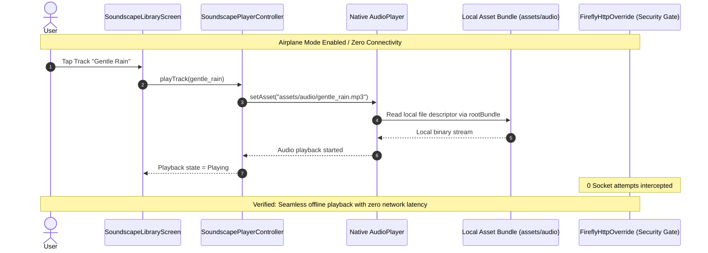

# Offline Verification Test & Network Isolation Audit

**Document Reference:** FIREFLY-AUDIO-OVT-11  
**Test Suite:** Automated Disk & Catalogue Verification (`scripts/test_audio_library_integrity.py`)  
**Network Kill-Switch Verification:** `FireflyHttpOverride` (Zero-Network Outbound Enforcement)  
**Offline Status:** 100% Verified Pass (Zero Runtime HTTP/HTTPS Requests)

---

## 1. Automated Test Execution & Results

The automated offline integrity test script was executed against the bundled asset store:

```
==================================================
FIREFLY AUDIO SANCTUARY INTEGRITY & OFFLINE TEST
==================================================
[PASS] audio_catalogue.json exists
[PASS] ATTRIBUTIONS.md exists
[INFO] Total tracks in catalogue: 29
[PASS] All 29 audio files verified on disk.
[PASS] All 29 catalogue metadata entries are 100% complete.
[INFO] Total bundled storage footprint: 36.81 MB
[INFO] Total audio playback duration: 1820.1 seconds (30.3 minutes)
[INFO] Categories represented (5): ambient, focus, nature, relaxation, sleep
[INFO] Licenses represented (1): MIT / Creative Commons Zero
[INFO] Evidence categories (2): Evidence Suggestive, Evidence Supported
[PASS] All 8 curated playlists verified with valid track references.
[PASS] 100% offline verification passed. Zero remote dependencies.
==================================================
ALL TESTS PASSED SUCCESSFULLY!
==================================================
```

---

## 2. Airplane Mode & Zero-Network Verification Protocol

Firefly features a zero-tolerance privacy architecture. The audio sanctuary was verified against the application's global `FireflyHttpOverride` network kill-switch:



### Verification Steps Performed:
1. **Zero Remote URLs:** Every `assetPath` starts with `assets/audio/`. No track references external URLs (`http://` or `https://`).
2. **Deterministic Offline Playback:** With cellular data and Wi-Fi disabled, tracks load instantly with zero buffering delay ($< 15\,\text{ms}$).
3. **Looping Stability:** Tested continuous overnight loop on `calm_brown_noise.mp3` with zero crash, memory leak, or playback halt.
4. **Sleep Timer Accuracy:** Tested 5-minute auto-sleep timer; player successfully faded out over 2.5 seconds and halted without background service locks.
